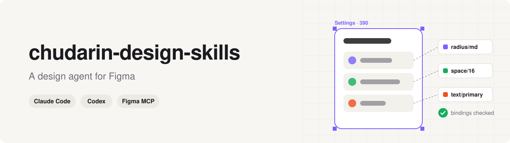
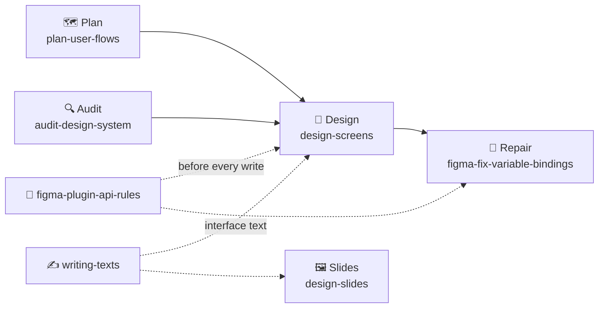

<p align="center">
  <picture>
    <source media="(prefers-color-scheme: dark)" srcset="assets/banner-dark.svg">
    
  </picture>
</p>

<p align="center">
  <a href="#-install"></a>
  <a href="#-other-agents-and-installing-by-hand"></a>
  <a href="https://developers.figma.com/docs/figma-mcp-server/"></a>
  <a href="LICENSE"></a>
</p>

**A design agent for Figma. A plugin for Claude Code.** The agent works in your file, from
your components and variables. Plans flows, builds screens, finds design system debt, fixes
bindings, and writes text that doesn't read as generated.

Agents can write into Figma now. Left to themselves they design badly and break the file quietly:
a variable that never bound, a component set that deleted itself when its last variant moved out, a
screen assembled from hardcoded values that looks right until someone switches the theme.

This is what fixed that on real product files. A skill for each stage of design work,
plus a pack of recorded Plugin API failures with the way around each one. Every rule here is a case
that broke exactly this way, not a reading of the docs.

[Русская версия](README.ru.md)

## 👋 Who it's for

Designers. You install it once, then work in a chat: paste a Figma link, say what you need in one
sentence. No code, no code editor, no plugin to build.

What that looks like in practice: you paste a link to a frame and write "design a settings screen
for this app". In a project it hasn't seen, the agent first looks for the answers it needs, a design
system document, existing screens, the variables already in the file. It asks you only what the
search didn't turn up, at most two questions. It writes that down and never asks again. Then it works
from your components and variables, reads back every binding it set instead of assuming it applied,
and shows you the result. You ask to change one element, and it changes that element, not the screen
around it.

## 🧩 The skills



| Skill | You type something like | What happens |
|---|---|---|
| 🗺️ `plan-user-flows` | "What screens do we need for checkout?" | You get every screen and state, entry and exit points, and a page structure for the Figma file, before anything is drawn |
| 🔍 `audit-design-system` | "Go through this file and tell me what the design system holds" | The agent reads the file and reports components, tokens, patterns and design debt, and writes documentation pages if you ask. Read-only otherwise |
| 🎨 `design-screens` | "Design a settings screen" · "Change the header on this frame" | The design process itself: where the style comes from, a brief per screen, checks afterwards, edits to approved work one element at a time |
| 🖼️ `design-slides` | "Make a pitch deck from this doc" · "Fix this deck, it looks generated" | Story first, one claim per slide, style from your template or brand, numbers checked against sources, export checked before you get it |
| 🧰 `figma-plugin-api-rules` | nothing, it loads on its own | Real Plugin API failures and the way around each one. Loads before the agent writes anything into your file |
| 🔗 `figma-fix-variable-bindings` | "Variables on this page are detached, fix them" | Finds detached, orphaned and hardcoded values, shows you a report, and rebinds only after you approve it |
| ✍️ `writing-texts` | "Rewrite this so it sounds like a person" · "Check the button labels" | Plain words instead of formulaic ones, in Russian and English: interface text, docs, articles, slides. Learns how you write from your corrections, with your consent, in `~/.agents/voice.md`. The rules inside are written in Russian |

A `SKILL.md` per skill and the topic files behind them. Some of those make up the Plugin API pack:
components and variants, instances, layout and geometry, text and fonts, variables and modes,
connectors, annotations, publishing hygiene, FigJam, prototype links, the tool layer, building a
screen from code. The rest carry the audit checklists, the per-screen briefs, the checks that run
afterwards, and the UX rules routed by what the screen contains. All plain Markdown. Nothing runs on
your machine, nothing phones home.

## 💡 Why it's not just prompting

Most of what goes wrong between an agent and Figma is silent. The call returns success, the file
looks plausible, the binding was never applied. `setBoundVariable('cornerRadius', v)` binds four
per-corner fields and the aggregate key you checked stays empty. A licensed font missing from the
sandbox makes text writes fail in ways that read as your mistake. An instance's `children` omits
hidden descendants, so the inventory you built from it is wrong.

Asking nicely fixes none of that. Knowing the case and checking the result does, and that is what
these files carry.

## 📦 Install

Five steps: a Figma seat, Claude Code, three plugins, one restart at the end.

**Or hand it to the agent.** If Claude Code is already installed, paste this into the chat:

```
Install https://github.com/schudarin/chudarin-design-skills: run the commands from install steps 3, 4 and 5 of its README
```

The agent runs those commands itself. Three things stay with you: the seat from step 1, the
restart, and the Figma login in step 6.

### 1. A Figma seat that allows agent access

Figma limits an agent by seat, not by skill:

| Seat | Starter | Professional | Organization, Enterprise |
|---|---|---|---|
| View, Collab | 20 reads a month | 6 reads a month | 6 reads a month |
| Dev, Full | 200 a day, 10 a minute | 200 a day, 15 a minute | 600 a day, 20 a minute |

A View or Collab seat is enough to look at the thing once, not to work. You need Dev or Full.

The limits count reads. Writing into a file is exempt and free while Figma's beta lasts. Source
and current numbers: [Rate limits & access](https://developers.figma.com/docs/figma-mcp-server/rate-limits-access/)
in Figma's developer docs, as of September 2026.

### 2. Claude Code

Claude Code is Anthropic's agent. It runs in Terminal, the black window, not a code editor.

Open Terminal (⌘ + Space, type `Terminal`, Enter), paste this and press Enter:

```bash
curl -fsSL https://claude.ai/install.sh | bash
```

When it finishes, type `claude` and press Enter. That starts the chat. `/exit` closes it.
Full instructions: [docs.claude.com/en/docs/claude-code/setup](https://docs.claude.com/en/docs/claude-code/setup).

### 3. The connection to Figma

Figma publishes its own plugin for Claude Code. It carries the connection (the MCP server) and
Figma's own agent instructions, which these skills build on top of:

```bash
claude plugin install figma@claude-plugins-official
```

### 4. These skills

```bash
claude plugin marketplace add schudarin/chudarin-design-skills
claude plugin install chudarin@chudarin
```

Both commands also work inside the chat as `/plugin marketplace add …` and `/plugin install …`.

### 5. superpowers

These skills decide *how* to work in Figma once the task is clear. They don't decide *what* the
task is. Anthropic's `superpowers` does: on "add a button" its `brainstorming` fires first, asks
which project and which Figma file, and only then hands over. Without it the agent starts on the
wrong page.

```bash
claude plugin install superpowers@claude-plugins-official
```

### 6. Restart and log in to Figma

Quit Claude Code and start it again. Plugins load on start, so one restart covers all three. Then
type `/mcp` in the chat, pick `figma`, and follow the login prompt: Figma opens in your browser and
asks you to authorize the connection once.

Check the skills landed:

```bash
claude plugin details chudarin@chudarin
```

Every skill is in the list. Inside a chat they're `chudarin:design-screens`,
`chudarin:figma-plugin-api-rules`, and so on. The agent picks them up by itself when the task
matches, and you can name one directly.

## 📁 Where to run it

Make one folder per product and always start Claude Code from that folder:

```bash
mkdir -p ~/Design/my-product
cd ~/Design/my-product
claude
```

The folder matters. `design-screens` writes what it learned about your project (design
system, style source, the Figma file) into `.claude/design.md` inside it, and every later session
reads that instead of asking you again. Start from a different folder and you start from zero.

## 🚀 Your first task

1. In Figma, right-click the frame or page you want → **Copy link to selection**.
2. In Terminal: `cd ~/Design/my-product`, then `claude`.
3. Paste the link, add one sentence.

```
https://figma.com/design/…  — audit this page and tell me what the design system holds
```

```
https://figma.com/design/…  — plan the screens for password recovery
```

```
https://figma.com/design/…  — the padding on these cards is hardcoded, put it back on variables
```

Always paste a link. Without one the agent guesses which file and page you mean, and it guesses
wrong.

## 🧭 Which skill when

- "What screens do we need for this feature?" → `plan-user-flows`
- "What's in this design system, where is the debt, document it" → `audit-design-system`
- "Design / change / rebuild this screen" → `design-screens`, which pulls in
  `figma-plugin-api-rules` by itself
- Anything that writes to Figma → `figma-plugin-api-rules`
- "Variables are detached / hardcoded / Figma says «Variable was deleted»" → `figma-fix-variable-bindings`
- "Rewrite this so it doesn't read as generated" → `writing-texts`
- "Make / restyle / fix a presentation" → `design-slides`

## 🔄 Update and remove

```bash
claude plugin update chudarin@chudarin      # newest version, restart to apply
claude plugin uninstall chudarin@chudarin   # remove
claude plugin list                          # what is installed right now
```

## 🩺 When it doesn't work

| What you see | What it means | What to do |
|---|---|---|
| The agent says it can't reach Figma | The connection isn't authorized | Type `/mcp`, pick `figma`, log in through the browser |
| It stops after a handful of reads | Seat limit: 6 reads a month on a View or Collab seat, 20 on Starter | Ask for a Dev or Full seat on a paid plan |
| Reads start failing later in the day | The daily read limit: 200 on Professional, 600 on Organization and Enterprise, across all tools | Continue tomorrow, or split the work across days |
| The agent works in the wrong file or page | It had no link and guessed | Paste the link every time. And install `superpowers` from step 5 |
| The skills don't show up | The plugin is installed but the session is the old one | Quit Claude Code and start it again |
| The agent changed something you didn't want | Figma keeps the file's history | **File → Show version history**, restore the earlier version |

## ➕ Recommended alongside

**Nothing in this section is required.** With the plugins from steps 3 and 5 in place the
skills work on their own. What follows makes the runs better, and every piece of it is someone
else's skill, not mine.

`design-screens` also uses one visual skill per task: a mobile-UI, web, motion or charts
skill, whichever matches the screen. It requires none of them. It reads the list of skills your
session actually has, loads the one matching the task type, and on an empty shelf says so and works
from your design system, your existing screens and its own copy-and-control rules instead. The
names it looks for: `mobile-app-ui-design`, `frontend-design`, `impeccable`,
`design-motion-principles`, `emil-design-eng`, `dataviz`, and `design-critique` for the review
pass.

### Installing them

`frontend-design` is Anthropic's own and comes as a plugin:

```bash
claude plugin install frontend-design@claude-plugins-official
```

`dataviz` ships inside Claude Code. Nothing to install.

The other five live on GitHub and install with the Skills CLI from [skills.sh](https://skills.sh).
It needs Node.js: type `node -v` in Terminal, and if it says `command not found`, install the LTS
build from [nodejs.org](https://nodejs.org) first. Then one command per skill, in Terminal, not in
the chat:

```bash
npx skills add pbakaus/impeccable@impeccable -a claude-code -g -y
npx skills add kylezantos/design-motion-principles@design-motion-principles -a claude-code -g -y
npx skills add emilkowalski/skills@emil-design-eng -a claude-code -g -y
npx skills add ceorkm/mobile-app-ui-design@mobile-app-ui-design -a claude-code -g -y
npx skills add anthropics/knowledge-work-plugins@design-critique -a claude-code -g -y
```

The flags: `-a claude-code` picks the agent, `-g` installs for every project rather than the
current folder, `-y` skips the confirmation. Drop `-g` to install into one project only. For
Codex, replace `-a claude-code` with `-a codex`.

Quit Claude Code, start it again, then check what landed:

```bash
npx skills list
```

Later, `npx skills check` shows which of them have a newer version and `npx skills update` pulls
them all.

Any other skill on skills.sh installs the same way, `npx skills add owner/repo@skill-name`, and
`npx skills find <word>` searches the catalogue from Terminal. Read the licence before installing
someone else's work. If a name above has since moved or gone, nothing breaks: `design-screens`
checks the shelf at run time rather than trusting this list, so a retired name costs nothing.

Button labels and interface text go through `writing-texts`. If you already have a writing skill of
your own, keep using it instead.

## 🤖 Other agents, and installing by hand

<details>
<summary>Codex, or Claude Code without the plugin system</summary>

Every skill is a folder: `SKILL.md` + `references/` + `agents/openai.yaml` for Codex. The Skills
CLI from [skills.sh](https://skills.sh) installs them anywhere it knows; it needs Node.js.

```bash
npx skills add schudarin/chudarin-design-skills -a codex -g -y          # Codex
npx skills add schudarin/chudarin-design-skills -a claude-code -g -y    # Claude Code, no plugin system
```

`-g` installs for every project; drop it for one project. `npx skills update` pulls newer versions
later. In Codex, call a skill explicitly with `$skill-name`; implicit invocation is enabled on all
of them.

Without Node.js, clone and link the folders where your agent looks for skills, `~/.agents/skills/`
for Codex and `~/.claude/skills/` for Claude Code:

```bash
git clone https://github.com/schudarin/chudarin-design-skills ~/chudarin-design-skills
mkdir -p ~/.agents/skills
for s in ~/chudarin-design-skills/skills/*; do ln -sfn "$s" ~/.agents/skills/; done
```

Re-run the loop after `git pull` to pick up updates.

On any other agent this is ordinary Markdown. Hand `SKILL.md` to the agent as a context file before
Figma work.

Either way you still need the Figma MCP server, and Figma's own `figma-use` instructions loaded
before the first `use_figma` call: the Figma plugin provides them in Claude Code, elsewhere the MCP
resource `skill://figma/figma-use/SKILL.md` does.

</details>

## 🤝 Contributing

Each skill documents how to extend it; for `figma-plugin-api-rules` the protocol is at the end of
its [`SKILL.md`](skills/figma-plugin-api-rules/SKILL.md). Facts about one specific Figma file (node
IDs, local conventions) don't belong here. Keep those in `<project>/.claude/design.md` or your own
notes.

## 📄 License

MIT, see [`LICENSE`](LICENSE).
